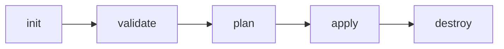

# Terraform

- [Infrastructure as Code](https://stackoverflow.com/questions/47699945/terraform-how-is-it-used)
  - Visibility
  - Stability
  - Scalability
  - Security
  - Audit
- Ref:
  - https://github.com/stacksimplify/hashicorp-certified-terraform-associate
  - https://github.com/stacksimplify/terraform-cloud-demo1
  - https://github.com/stacksimplify/terraform-aws-s3-website
  - https://github.com/stacksimplify/terraform-sentinel-policies

## workflow



- [`init`](https://developer.hashicorp.com/terraform/cli/commands/init)
  - used to initialize a working directory containing terraform config file
  - downloads providers
  - Creates `.terraform` and `.terraform.lock.hcl`
  - Will initialize backends and install plugins every time it's run
  - `-upgrade`: to upgrade version of provider downloaded
- `get`
  - Will get/download modules and will not download providers, backend and plugins.
- `validate`
  - validates the terraform configurations file in that respective directory to ensure they are syntactically valid and internally consistent.
- `plan`
  - creates an execution plan
  - terraform performs a refresh and determines what actions are necessary to achieve the desired state specified in configuration files
  - `-out filename.txt`: writes the plan output in file which can be provided in apply
  - `-target=resource`: will target configuration for only specified subset of resource
- `apply`
  - used to apply the changes required to reach the desired state of the configuration.
  - By default, apply scans the current directory for the configuration and applies the changes appropriately.
  - creates `terraform.tfstate`
  - `-auto-approve`: will not prompt to type `yes`
  - `-target=resource`: will target configuration for only specified subset of resource
- `destroy`
  - used to destroy the terraform-managed infrastructure.
  - `-auto-approve`: will not prompt to type `yes`
- `fmt`
  - To format the `.tf` files according to terraform format

## Terraform Core Basic

- Keep terraform and providers (version-specific) in one file
- Keep resource blocks in another file
- Variable/Arguments in string can be provided as `"some string ${variable}"`

### [Blocks](#blocks-1)

- Top level Block or wrapper to wrap/contain specific configuration.
- Terraform language uses a limited number of top-level block types, which are blocks that can appear outside of any other block in a TF configuration file.
- Most feature are implemented as top-level blocks
- Blocks can be categorized into three categories as follows
  1. Fundamental Blocks
     1. [Terraform Block](#terraform-block)
     2. [Providers Block](#provider-block)
     3. [Resources Block](#resource-block)
  2. Variable Blocks
     1. [Input Variables Block](#input-variable-block)
     2. [Output Values Block](#output-values)
     3. [Local Values Block](#local-values)
  3. Calling/Referencing Blocks
     1. [Data Sources Block](#data-sources)
     2. [Modules Block](#modules-block)
- ```py
  # Template
  <BLOCK TYPE> "<BLOCK LABEL>" "<BLOCK LABEL>"   {
    # Block body
    <IDENTIFIER> = <EXPRESSION> # Argument
  }

  # AWS Example
  resource "aws_instance" "ec2demo" { # BLOCK
    ami           = "ami-04d29b6f966df1537" # Argument
    instance_type = var.instance_type # Argument with value as expression (Variable value replaced from variables.tf
  }
  ```

### Arguments

- configures a particular resource; because of this, many arguments are resource-specific
- They can be required or optional

### Attributes

- Values exposed by a particular resource.
- References to resource attributes takes the format `resource_type.resource_name.attribute_name`
- Assigned by underlying cloud provider or API

### Meta-arguments

- Changes a resource type's behavior and are not resource-specific
- Terraform specific arguments.
- eg: `depends_on` ,`count`, `for_each`, `provider`,`lifecycle`,`Provisioners` & `Connections`

#### `depends_on`:

- for specifying hidden dependencies that Terraform can't automatically infer
- available in Module and Resource Block

#### `count`:

- for creating multiple resource instances according to a count
- each instance has a distinct infrastructure object associated with it, and each is separately created, updated or destroyed when the configuration is applied
- Accepts numeric expressions
- `count.index`: The distinct index number (starting with 0) corresponding to the instance
- Can access each instance explicitly by `aws_instance.name[index]`
- available in Module and Resource Block
- Cannot use `count` and `for_each` together

#### `for_each`:

- to create multiple instances according to a map, or set of strings
- each instance has a distinct infrastructure object associated with it, and each is separately created, updated or destroyed when the configuration is applied
- An additional `each` object is available in expressions, so you can modify the configuration of each instance.
  - `each.key`: The map key (or set member) corresponding to this instance
  - `each.value`: the map value corresponding to this instance. (if a set was provided this is the same as `each.key`)
- set example
  ```py
  # each.key = each.value
  for_each = toset(["one", "two"])
  each.key = one
  each.key = two
  ```
- map eg
  ```py
  for_each = {
    key = "value"
  }
  each.key = key
  each.value = value
  ```
- available in Module and Resource Block
- Cannot use `count` and `for_each` together

#### `provider`:

- for selecting a non-default provider configuration

#### `lifecycle`:

- for lifecycle customizations which uses special nested lifecycle block

##### `create_before_destroy`

- This will create new resource first and then will destroy old resource
- Default behavior of a resource: Destroy Resource and re-create Resource
- ```js
  lifecycle {
    create_before_destroy = true
  }
  ```

##### `prevent_destroy`

- This will prevent resource form being destroyed.
- Default behavior of a resource: Do not prevent.
- ```js
  lifecycle {
    prevent_destroy = true
  }
  ```

##### `ignore_change`

- This will tell terraform to ignore changes which are specified lifecycle
- Default behavior of a resource: Do not ignore any change even manual change.
- ```py
  lifecycle {
    ignore_change = [
      # Ignore changes to tags
      tags,
    ]
  }
  ```
- Instead of a list, the special keyword `all` maybe used to instruct Terraform to ignore all attributes, which means that Terraform can create and destroy the remote object but will never propose updates to it.

#### [`provisioner`](#terraform-provisioners):

- for taking extra actions after resource creation, (eg. install some app on server or do something on local desktop after resource is created at remote destination)

### Terraform States

- It is the primary core thing for terraform to function
- In a short way, its the underlying database containing the resources information which are provisioning using Terraform
- **Primary Purpose:** To store bindings between objects in a remote system and resource instances declared in your configuration.
- When Terraform creates a remote object in response to a change of configuration, it will record the identity of that remote object against a particular resource instance, and then potentially update or delete that object in response to future configuration changes.
- Terraform state file created when we first run the `terraform apply`
- Terraform state file is created locally in working directory.
- If required, we can configure the `backend block` in `terraform block` which will allow us to store state file remotely.

#### Terraform Commands related to State

##### `terraform show`

- It is used to provide human-readable output from a state or plan file.
- terraform plan output files are binary files, hence we need `terraform show`
- `-json` will show output in JSON format
- ```
  terraform show
  terraform plan -out=plan.out
  terraform show plan.out
  terraform show -json plan.out
  ```

##### `terraform refresh`

- Comes under Terraform Inspecting State
- This command is used to reconcile the state Terraform knows about (via its state file) with the real-world infrastructure.
- It will update local state file against real resources in cloud
- Execution order: refresh > plan > make a decision > apply

##### `terraform state list`

- List resources from Terraform state

##### `terraform state show RESOURCE_NAME`

- shows the attributes of a single resource from Terraform state

##### `terraform state mv src_path destination_path`

- This commands comes under Terraform Moving Resources
- This command will move an item matched by the address given to the destination address
- This command can also move to destination address in a completely different state file
- `-dry-run`: this will do dry run for specified command

##### `terraform state rm RESOURCE_NAME`

- This command is used to remove items from the Terraform state.
- This command can remove single resources, single instances of a resource, entire modules and more.
- `-dry-run`: this will do dry run for specified command

##### `terraform state replace-provider old_provider new_provider`

- Used to replace provider value

##### `terraform state pull/push`

- This commands comes under Terraform Disaster Recovery Concept
- `terraform state pull` is used to manually download and output the state from remote state.
- `terraform state push` is used to manually upload a local state file to remote state.

##### `terraform force-unlock LOCK_ID`

- This command comes under Terraform Disaster Recovery Concept
- Manually unlock the state for defined configuration
- This will not modify your infrastructure
- This command removes the lock on the state for the current configuration
- This behavior of this lock is dependent on the backend being used
- Local state files cannot be unlocked by another process
- `LOCK_ID` can be found from backend state locking storage

##### `terraform taint/untaint RESOURCE_NAME_LOCALLY`

- These commands comes under Terraform Forcing Re-creation of Resources
- `terraform taint` command manually marks a Terraform-managed resource as tainted, forcing it to be destroyed and recreated on the next apply.
- `terraform untaint` command manually unmarks a Terraform-managed resource as tainted, restoring it as the primary instance in the state.
  - This reverses either a manual terraform taint or the result of provisioners failing on a resource.
  - This command will not modify infrastructure, but does modify the state file in order to unmark a resource as tainted.

#### [Terraform Backends](https://developer.hashicorp.com/terraform/language/settings/backends/configuration)

- Each Terraform configuration can specify a backend which defines where and how operations are performed, where state snapshots are stored, etc.
- Backend configurations is only used by Terraform CLI.
- Terraform Cloud and Terraform Enterprise always use their own state storage when performing Terraform runs, so they ignore any backend block in the configuration.
- For Terraform Cloud, it is always recommended to use backend block in Terraform configuration for commands like `terraform taint` which can be executed only using Terraform CLI

#### Backend Usage

- Store State
  - Terraform uses persistent state data to keep track of the resources it manages.
  - Everyone working with a given collection of infrastructure resources must be able to access the same state data (shared state storage)
- State Locking
  - State locking is to prevent conflicts and inconsistencies when the operations are being performed
- Operations
  - Operations refers to performing API requests against infrastructure services in order to create, read, update or destroy resources.
  - Not every terraform subcommand performs API operations; many of them only operate on state data.
  - Only two backends actually perform operations: local and remote.
  - The remote backend can perform API operations remotely, using Terraform Cloud or Terraform Enterprise

#### Backend Types

##### Enhanced Backends

- Enhanced backends can both store state and perform operations.
- There are only two enhanced backends: local and remote
- Example for Remote Backend Performing Operations: Terraform Cloud, Terraform Enterprise.

##### Standard Backends

- Standard backends only store state and rely on the local backend for performing operations.
- Example: AWS S3, Azure RM, Consul, gcs http and many more

### Terraform Clean up

- Run `terraform destroy` to destroy/delete/remove all the resources from provider as well as from state
- Run `rm -rf .terraform*` and `rm -rf terraform.tfstate*` to remove files related to terraform created during `init`, `plan` and `apply`.

## Blocks

1. [Terraform Block](#terraform-block)
2. [Providers Block](#provider-block)
3. [Resources Block](#resource-block)
4. [Input Variables Block](#input-variable-block)
5. [Output Values Block](#output-values)
6. [Local Values Block](#local-values)
7. [Data Sources Block](#data-sources)
8. [Modules Block](#modules-block)

### [Terraform Block](https://developer.hashicorp.com/terraform/language/settings)

- Special block used to configure some **behaviors**
- Specifying a required **Terraform Version**
- Specifying **Provider Requirements**
- Configuring a Terraform Backend (**Terraform State**)
- Only constant values can be used, no arguments/variables or built in functions can be used

#### Terraform Block Structure

```py
terraform {
  # Required Terraform Version
  required_version = "~> 0.14"
  # Required Providers and their Versions
  required_providers {
    aws = {
      source  = "hashicorp/aws"
      version = "~> 3.21" # Optional but recommended
    }
    random = {
      source = "hashicorp/random"
      version = "3.0.1"
    }
  }
  # Remote Backend for storing Terraform State in S3 bucket
  backend "s3" {
    bucket = "mybucket"
    key    = "path/to/my/key"
    region = "us-east-1"
    # for state locking
    dynamodb_table = "table_name"
  }
  # Experimental Features (Not required)
  experiments = [ example ]
  # Passing Metadata to Providers
  # (Super Advanced - Terraform documentation says not needed in many cases)
  provider_meta "my-provider" {
    hello = "world"
  }
}
```

#### Terraform Block Argument

##### `required_version`

- Version of terraform.
- Should match with local CLI version.
- `required_version = ">= x.xx.xx, < x.x.x"`
  - `=`: allows only one exact version number.
  - `!=`: Excludes an exact version number.
  - `>=, <=, >, <`: Comparison against a specified version.
  - `~>`: Allows only the rightmost version component to increment (minor & patches).

##### `required_providers`

- specifies all of the providers required by the current module, mapping each local provider name to a source address and a version constraint.
- downloads the mentioned providers with `terraform init`.
- Can have more than one provider or random provider.
- ```py
  required_providers {
    provider_name_variable = {
      source = "hashicorp/provider_name"
      version = "OP x.xx"
    }
  }
  ```

##### `backend`

- To store the state information of the configuration.
- To configure the backend storage.
- ```py
  backend "service" {
    attribute = "value"
    attribute2 = "value"
  }
  ```

##### `experiments`

- For experimental features and to enable it
- `experiments = [ module_name ]`

##### `provider_meta`

- For each provider a module is using, if the provider defines a schema for it.
- This allows the provider to receive module-specific information, and is primarily intended for modules distributed by the same vendor as the associated provider.
- ```py
  provider_meta "provider_name" {
    attribute = "value"
  }
  ```

### [Provider Block](https://developer.hashicorp.com/terraform/language/providers/configuration)

- **HEART** of Terraform
- Terraform relies on providers to **interact with Remote Systems**
- Declare providers for Terraform to **install providers** and use them
- Provider configurations belong to **Root Module**
- Every resource type is implemented by a provider
- ```py
  # Provider Block
  provider "provider_name_var" {
    attribute = "value"
    identifier = "value"
  }
  ```
- Providers and Modules are available in [Terraform Provider Registry](https://registry.terraform.io/)
- For provider to communicate we need to authenticate ourself for aws [authentication type](https://registry.terraform.io/providers/hashicorp/aws/latest/docs#authentication)
- Authenticate Ways
  - Static Credential
  - Environment Variables
  - Shared Credentials/configuration file
- ```py
  # Provider Block
  provider "aws" {
    region = "us-east-1"
    profile = "default"
  }
  ```
- For multiple provider we can provide `alias` attribute in the block so we can refer to it as `provider_name_var.alias_name`
- ```py
  # aws.west to access this provider block
  provider "aws" {
    region = "us-west-1"
    profile = "default"
    alias = "west"
  }
  ```
- by default resource will map to default provider, to configure resource for another provider we need to add `provider = provider_name.alias_name` in resource block

### [Resource Block](https://developer.hashicorp.com/terraform/language/resources/syntax)

- Each resource block describes one or more infrastructure objects
- **Resource Syntax**: How to declare Resources?
- **Resource Behavior**: How Terraform handles resource declarations?
- **Provisioners**: We can configure Resource post-creation actions
- ```py
  resource "resource_type" "resource_local_name" {
    resource_arguments = "value"
    meta_arguments = value
  }
  ```

#### Resource Syntax

##### Resource Type

- It determines the kind of infrastructure object it manages and what arguments and other attributes the resource supports

##### Resource Local Name

- It is used to refer to this resource from elsewhere in the same Terraform module, but has no significance outside that module's scope.
- The resource type and name together serve as an identifier for a given resource and so must be unique within a module.

##### Resource Arguments

- Will be specific to resource type.
- Argument values can make use of Expressions or other Terraform Dynamic Language Features

##### Meta-Arguments

- Can be used with any resource to change the behavior of resources.
- Same as core meta-arguments

#### Resource Behavior

- Depends on provider side intelligence when to exhibit which behavior
- Takes reference from `terraform.tfstate` file for performing actions after creation.

##### Create Resource

- Create resource that exist in the configuration but are not associated with a real infrastructure object in the state.

##### Destroy Resource

- Destroy resources that exist in the state but no longer exist in the configuration.

##### Update in place Resource

- Update in-place resources whose arguments have changed.

##### Destroy and recreate

- Destroy and recreate resources whose arguments have changed but which cannot be updated in-place due to remote API limitations.

### [Input Variable Block](https://developer.hashicorp.com/terraform/language/values/variables)

- `Input variables` are like function arguments.
- Input variables let you customize aspects of Terraform modules without altering the module's own source code.
- This functionality allows you to share modules across different Terraform configurations, making your module composable and reusable.
- When you declare variables in the root module of your configuration, you can set their values using CLI options and environment variables.
- When you declare them in child modules, the calling module should pass values in the module block.
- We can provide variables in following ways
  - Provide Input Variables when prompted during terraform plan or apply, happens when default value is not provided in variable block
  - Override default variable values using CLI argument `-var variable_name=value`
  - Override default variable values using Environment Variables
    - `export TF_VAR_variable_name=value` need to be done before CLI cmd
    - `unset TF_VAR_variable_name` to unset the environment variables
  - Provide Input Variables using `terraform.tfvars` files.
    - If the file name is `terraform.tfvars`, terraform will auto-load the variables present in this file by overriding the `default` values in `variables.tf`
    - ```py
      variable_name = "value"
      variable_2 = value_num
      ```
  - Provide Input Variables using `<any-name>.tfvars` file with CLI argument `-var-file`
  - Provide Input Variables using `.auto.tfvars` file extension to load automatically like `terraform.tfvars`
- The above mechanisms for setting variables can be used together in any combination.
- If the same variable is assigned multiple values, Terraform uses the last value it finds, overriding any previous values.
- The same variable cannot be assigned multiple values within a single source.
- Terraform loads variables in the following order, with **later sources taking precedence over earlier ones**:
  1. Environment variable
  2. `terraform.tfvars`
  3. `terraform.tfvars.json`
  4. `*.auto.tfvars` or `*.auto.tfvars.json`
  5. `-var` and `-var-file` options

#### Variable Block Structure

```r
variable "variable_name" {
  description = "description of variable"
  type = string
  default = "default_value" # if no default value then it will prompt on CLI
  validation {
    condition = length(var.variable_name) > 4 && substr(var.variable_name, 0, 5) == "value"
    error_message = "Error message: \"Will be thrown\""
  }
  sensitive = true # default is false
}

variable "variable_list_name" {
  description = "list variable"
  type = list(string)
  default = ["value1", "value2", "value3"]
  validation {
    condition = length(var.variable_list_name) == 3
    error_message = "Error message: \"Will be thrown\""
  }
}


variable "map_variable_name" {
  description = "map variable"
  type = map(string)
  default = {
    "key" = "value"
    "key2" = num_value
  }
}

resource "RESOURCE" "RESOURCE_LOCAL_NAME" {
  name = var.variable_name
  attr2 = var.variable_list_name[0]
  attr3 = var.map_variable_name["key"]
  tag = var.map_variable_name
}
```

#### Variable Block Argument

- `default` - A default value which then makes the variable optional.
- `type` - This argument specifies what value types are accepted for the variable. `string`, `number`, `bool`, `list(<TYPE>)`, `set(<TYPE>)`, `map(<TYPE>)`, `object({<ATTR NAME> = <TYPE>, ...})`, `tuple([<TYPE>, ...])`, `any`
  - The keyword any may be used to indicate that any type is acceptable.
- `description` - This specifies the input variable's documentation.
- `validation` - A block to define validation rules, usually in addition to type constraints.
- `sensitive` - Limits Terraform UI output when the variable is used in configuration and will **redact** these values in cmd output and log file.
  - It will be visible in `terraform.tfstate` file
- `nullable` - Specify if the variable can be null within the module.

### [Output Values](https://developer.hashicorp.com/terraform/language/values/outputs)

- `Output values` are like function return values.
- Output values make information about your infrastructure available on the command line, and can expose information for other Terraform configurations to use.
- `terraform output` cmd will fetch output from `terraform.tfstate` file and will display it.
  - `terraform output output_variable_name` cmd will fetch specified output from `terraform.tfstate` file and will display it.
  - `terraform output -json` cmd will fetch output from `terraform.tfstate` file in json format and will display it.
- Usage:
  - A root module can use outputs to print certain values in the CLI output after running `terraform apply`.
  - A child module can use outputs to expose a subset of its resource attributes to a parent module.
  - When using remote state, root module outputs can be accessed by other configurations via a `terraform_remote_state` **data source**

#### Output Value Block Structure

```r
output "output_name" {
  description = "Description of output"
  value = resource_type.resource_name.attribute
  sensitive = true # default false
}

output "output_name2" {
  description = "Description of output2"
  value = "some string ${resource_type.resource_name.attribute}"
}

output "output_name3" {
  description = "Description for set type resource"
  value = "some string ${resource_type.resource_name.*.attribute}"
  # * specifies for all index
}
```

#### Output Value Block Argument

- `description` - This specifies the Output Value documentation.
- `sensitive` - Limits Terraform UI output when the variable is used in configuration and will **redact** these values in cmd output and log file.
  - It will be visible in `terraform.tfstate` file
- `depends_on` - for specifying hidden dependencies that Terraform can't automatically infer

### [Local Values](https://developer.hashicorp.com/terraform/language/values/locals)

- `Local values` are like a function's temporary local variables.
- A local value assigns a name to an expression, so you can use the name multiple times within a module instead of repeating the expression.
- Once a local value is declared, you can reference it in expressions as `local.<NAME>`.
- A local value can only be accessed in expressions within the module where it was declared.

#### Local Value Block Structure

```r
locals {
  key1 = "value"
  key2 = "${var.variable_name} value2"
  key_tags = {
    tag1 = "val1"
    tag2 = "val2"
  }
}

resource resource_name local_name {
  attribute = local.key1
  tag_attribute = local.key_tags
}
```

### [Data Sources](https://developer.hashicorp.com/terraform/language/data-sources)

- Data sources allow Terraform to use information defined outside of Terraform, defined by another separate Terraform configuration, or modified by functions.
- Each provider may offer data sources alongside its set of resource types.
- Attributes are based on type of resource and providers.
- `count` and `for_each` meta-argument are present for data block.

#### Data Source Block Structure

```r
data "RESOURCE_NAME" "LOCAL_NAME" {
  resource_attr = "value"
  resource_attr_2 = ["value", "value2"]
  attr {
    prop = "value_name"
    values = ["value_one"]
  }
}

resource "RESOURCE_NAME" "LOCAL_NAME" {
  attr_id = data.RESOURCE_NAME.LOCAL_NAME
}
```

### [Modules Block](https://developer.hashicorp.com/terraform/language/modules/syntax)

- A module is a container for multiple resources that are used together.
- To call a module means to include the contents of that module into the configuration with specific values for its input variables.
- Modules are called from within other modules using module blocks

#### Modules Block Structure

```r
module "LOCAL_NAME" {
  source = "path/or/registry"
  version = "recommended for registry"
  input_var_1 = "value"
}

output "name" {
  description = "describe"
  value = module.LOCAL_NAME.output_attr
}
```

#### Modules Block Argument

- `source`: local-file path or module registry
- `version`: recommended for module from registry, not required for local file as they are as same version
- meta-arguments: `count`, `for_each`, `providers`, `depends_on`

## [Terraform Provisioners](https://developer.hashicorp.com/terraform/language/resources/provisioners/syntax)

- Provisioners can be used to model specific actions on the local machine or on a remote machine in order to prepare servers
  - Passing data into virtual machines and other compute resources
  - Running configuration management software (packer, chef, ansible)
- Provisioner kick-in timings
  - Creation-Time Provisioners
  - Destroy-Time Provisioners
- Failure Behavior
  - Continue: Ignore the error and continue with creation or destruction
  - Fail(the default behavior): Raise an error and stop applying. If creation provisioner, taint the resource
- Provisioners are a last resort
- First class terraform provider functionality may be available
- Provisioner Types
  - File Provisioner
  - remote-exec Provisioner
  - local-exec Provisioner
- Provisioner requires access to the remote resource via SSH or WinRM, and expect a nested `connection block` with details about how to connect.
  - Expressions in connection blocks cannot refer to their parent resource by name.
  - Instead, they can use the special `self` object.
- All provisioners support the `when` and `on_failure` meta-arguments
  - `when`: Defines when to execute the provisioner
    - default no need,
    - for destroy time `when = destroy`, the provisioner will run when the resource it is defined within is destroyed.
  - `on_failure`: Defines what to do on failure.
    - Default `fail` Raise an error and stop applying (the default behavior). If this is a creation provisioner, taint the resource.
    - `continue` to Ignore the error and continue with creation or destruction.

### Connection Block

- We can have connection block inside resource block for all provisioners or we can have connection block inside a provisioner block for that respective provisioner
- ```r
  resource RESOURCE_NAME LOCAL_NAME {
    connection {
      type = "connection_type" # ssh
      host = HOST_IP_ID # self.public_ip or with null resource direct ip
      user = "instance_user"
      password = ""
      private_key = file("file/path/.pem")
    }
  }
  ```

### `file` Provisioner

- File Provisioner is used to copy files or directories from the machine executing Terraform to the newly created resource.
- The file provisioner supports both ssh and winrm type of connections.
- ```r
  resource RESOURCE_NAME LOCAL_NAME {
    provisioner "file" {
      source = "src/path" # file or dir
      destination = "destination/path" # file or dir
    }

    provisioner "file" {
      content = "content of file"
      destination = "destination/path/file.ext"
    }
  }
  ```

### `local-exec` Provisioner

- The local-exec provisioner invokes a local executable after a resource is created.
- This invokes a process on the machine running Terraform, not on the resource.
- ```r
  provisioner "local-exec" {
    command = "command to run"
    working_dir = "in which dir command needs to run"
  }
  ```
  - `command` - (Required) This is the command to execute.
    - It is evaluated in a shell, and can use environment variables or Terraform variables.
  - `working_dir` - (Optional) If provided, specifies the working directory where command will be executed. The directory must exist.
  - `interpreter` - (Optional) If provided, this is a list of interpreter arguments used to execute the command.
    - The first argument is the interpreter itself.
    - The remaining arguments are appended prior to the command. This allows building command lines of the form "/bin/bash", "-c", "echo foo".
    - If interpreter is unspecified, sensible defaults will be chosen based on the system OS.
  - `environment` - (Optional) block of key value pairs representing the environment of the executed command. inherits the current process environment.

### `remote-exec` Provisioner

- The remote-exec Provisioner invokes a script on a remote resource after it is created.
- This can be used to run a configuration management tool, bootstrap into a cluster, etc.
- No arguments can be provided simultaneously in `remote-exec`
- ```r
  provisioner "remote-exec" {
    inline = [
      "first command",
      "second command"
    ]
  }
  ```
  - `inline` - This is a list of command strings.
  - `script` - This is a path to a local script that will be copied to the remote resource and then executed.
  - `scripts` - This is a list of paths to local scripts that will be copied to the remote resource and then executed.

### `null_resource`

- If you need to run provisioners that aren't directly associated with a specific resource, you can associate them with a `null_resource`.
- Instances of null_resource are treated like normal resources, but they don't do anything.
- Same as other resource, you can configure provisioners and connection details on a null_resource

## [Null Provider](https://registry.terraform.io/providers/hashicorp/null/latest/docs)

- The null provider is a rather-unusual provider that has constructs that intentionally do nothing.
- ```r
  terraform {
    required_version = "x.x.x"
    required_providers {
      null = {
        source = "hashicorp/null"
        version = "x.x.x"
      }
    }
  }
  ```

### [Null Resource](https://developer.hashicorp.com/terraform/language/resources/provisioners/null_resource)

- The `null_resource` resource implements the standard resource lifecycle but takes no further action.
- The `triggers` argument allows specifying an arbitrary set of values that, when changed, will cause the resource to be replaced.
  - A map of arbitrary strings that, when changed, will force the null resource to be replaced, re-running any associated provisioners.
- ```r
  resource "null_resource" "local_name" {
  triggers = {
    variable = "string"
    variable = timestamp() # timestamp() function to run always during terraform apply as timestamp() will return different string
  }
  }
  ```

## [Time Provider](https://registry.terraform.io/providers/hashicorp/time/latest/docs)

- The time provider is used to interact with time-based resources.
- The provider itself has no configuration options.
- ```r
  terraform {
    required_version = "x.x.x"
    required_providers {
      time = {
        source = "hashicorp/time"
        version = "x.x.x"
      }
    }
  }
  ```

### Time Resource

- Certain time resources, only perform actions during specific lifecycle actions:
- `time_offset`: Manages an offset time resource, which keeps an UTC timestamp stored in the Terraform state that is offset from a locally sourced base timestamp.
  ```r
  resource "time_offset" "local_name" {
  triggers = {
    variable = value
  }
  offset_days = 7
  }
  ```
  - At least one of the `offset_` arguments must be configured.
  - `offset_days` = Number of days to offset the base timestamp.
  - `offset_hours` = Number of hours to offset the base timestamp.
  - `offset_minutes` = Number of minutes to offset the base timestamp.
  - `offset_months` = Number of months to offset the base timestamp.
  - `offset_seconds` = Number of seconds to offset the base timestamp.
  - `offset_years` = Number of years to offset the base timestamp.
- `time_sleep`: Manages a resource that delays creation and/or destruction, typically for further resources. Sleeps when created and/or destroyed.
  ```r
  resource "time_sleep" "local_name" {
    depends_on = [resource] # if required
    create_duration  = "30s"  # Time duration to delay resource creation.
    destroy_duration = "30s"  # Time duration to delay resource destroy.
  }
  # Arbitrary map of values that, when changed, will run any creation or destroy delays again.
  triggers = {
    key = val
  }
  ```
- `time_static`: Manages a static time resource, which keeps a locally sourced UTC timestamp stored in the Terraform state.
  ```r
    resource "time_static" "local_name" {
      triggers = {
        variable = value
      }
    }
  ```
- `time_rotating`: Manages a rotating time resource, which keeps a rotating UTC timestamp stored in the Terraform state and proposes resource recreation when the locally sourced current time is beyond the rotation time.
  ```r
  resource "time_rotating" "example" {
    rotation_days = 30
  }
  ```
  - When the current time has passed the rotation timestamp, the resource will trigger recreation
  - At least one of the `rotation_` arguments must be configured.
  - `rotation_days`: Number of days to add to the base timestamp
  - `rotation_hours`: Number of hours to add to the base timestamp
  - `rotation_minutes`: Number of minutes to add to the base timestamp
  - `rotation_months`: Number of months to add to the base timestamp
  - `rotation_rfc3339`: Configure the rotation timestamp with an RFC3339 format of the offset timestamp.
  - `rotation_years`: Number of years to add to the base timestamp

## Terraform Workspaces

- Terraform states with a single workspace named **default**
- This workspace is special both because it is the default and also because it cannot ever be deleted
- By default, we are working in default workspace
- Named workspaces allow conveniently switching between multiple instances of a single configuration within its single backend
- A common use for multiple workspaces is to create a parallel, distinct copy of a set of infrastructure in order to test a set of changes before modifying the main production infrastructure.
- For example a developer working on a complex set of infrastructure changes might create a new temporary workspace in order to freely experiment with changes without affecting the default workspace
- They are convenient in a number of situations, but cannot solve all problems.
- Terraform will not recommend using workspaces for larger infrastructures inline with environments pattern like dev, qa, staging. Recommended to use separate configuration directories
- Terraform CLI workspaces are completely different from Terraform CLoud Workspaces

### Commands

- `terraform.workspace` will get the workspace name in manifests, which is useful to get unique name for resources and condition based resource allocation

#### `terraform workspace show`

- Display the current workspace being utilized

#### `terraform workspace list`

- Will list all the terraform workspace in the directory

#### `terraform workspace new WORKSPACE_NAME`

- Will create new workspace with name of WORKSPACE_NAME and switch to created workspace
- It will create directory with name `terraform.tfstate.d` and under this will create another directory with WORKSPACE_NAME and it's respective `terraform.tfstate` file

#### `terraform workspace select WORKSPACE_NAME`

- Will switch workspace to selected WORKSPACE_NAME

#### `terraform workspace delete WORKSPACE_NAME`

- Will delete workspace which is specified i.e. WORKSPACE_NAME

## Terraform Console

- We can use [Terraform Console](https://www.terraform.io/docs/cli/commands/console.html) which provides interactive console for evaluating expressions.
- We can evaluate validation expressions and functions.
- To start Terraform Console we need to enter `terraform console` in CLI.

## [Terraform Expression](https://developer.hashicorp.com/terraform/language/expressions)

- Expressions are used to refer to or compute values within a configuration.
- We can experiment expressions in console by running `terraform console
- Types
  - [Terraform Functions](#terraform-functions)
  - [Terraform Dynamic Expressions](#terraform-dynamic-expression)
  - [Terraform Dynamic Blocks](#terraform-dynamic-blocks)

### [Terraform Functions](https://developer.hashicorp.com/terraform/language/expressions/function-calls)

- The Terraform language has a number of built-in functions that can be used in expressions to transform and combine values.
- `<FUNCTION NAME>(<ARGUMENT 1>, <ARGUMENT 2>)`
- If the arguments to pass to a function are available in a list or tuple value, that value can be expanded into separate arguments. Provide the list value as an argument and follow it with the `...` symbol
- `<FUNCTION NAME>([<VALUE>, <VALUE>, <VALUE>]...)`
- The small set of special functions includes `file`, `templatefile`, `timestamp`, and `uuid`

#### Numeric Functions

##### `min`

- Min Function: Takes one or more numbers and returns the smallest number from the set.
- `min(12, 13, 14)`

##### `max`

- Max Function: Takes one or more numbers and returns the greatest number from the set.
- `max(12, 13, 14)`

##### `pow`

- pow Function: Calculates an exponent, by raising its first argument to the power of the second argument.
- `pow(3, 2)`

#### String Functions

##### `trim`

- Trim Function: Removes the specified characters from the start and end of the given string.
- `trim("?!hello?!", "!?")`

##### `trimprefix`

- Trimprefix Function: Removes the specified prefix from the start of the given string. If the string does not start with the prefix, the string is returned unchanged.
- `trimprefix("helloworld", "cat")`
- `trimprefix("helloworld", "hello")`

##### `trimsuffix`

- Trimsuffix Function: Removes the specified suffix from the end of the given string.
- `trimsuffix("helloworld", "world")`

##### `trimspace`

- Trimspace Function: Removes any space characters from the start and end of the given string.
- `trimspace("  hello\n\n")`

##### `join(separator, list)`

- Join Function: Produces a string by concatenating together all elements of a given list of strings with the given delimiter
- `join(", ", ["foo", "bar", "baz"])`

##### `split(",", "foo,bar,baz")`

- Split Function: Produces a list by dividing a given string at all occurrences of a given separator.
- `split(separator, string)`

##### `substr(string, offset, length)`

- `substr` extracts a substring from a given string by offset and length.

##### `upper`

- Upper Functon: Converts all cased letters in the given string to uppercase.
- `upper("hello")`

#### Collection Functions

##### `concat`

- Concat Function: Takes two or more lists and combines them into a single list.
- `concat(["a", ""], ["b", "c"])`

##### `contains(list, value)`

- Contains Function: Determines whether a given list or set contains a given single value as one of its elements.
- `contains(["a", "b", "c"], "a")`
- `contains(["a", "b", "c"], "d")`

##### `distinct`

- Distinct Function: Takes a list and returns a new list with any duplicate elements removed.
- `distinct(["a", "b", "a", "c", "d", "b"])`

##### `length`

- Length Function: determines the length of a given list, map, or string.
- `length("hello")`
- `length(["a", "b"])`
- `length(["a", "b"])`

##### `lookup(map, key, default)`

- Lookup Function: Retrieves the value of a single element from a map, given its key. If the given key does not exist, the given default value is returned instead.
- `lookup({a="ay", b="bee"}, "a", "what?")`
- `lookup({"web" = ["10.0.1.0/24","10.0.2.0/24"], "app" = ["10.0.11.0/24","10.0.12.0/24"], "db" = ["10.0.21.0/24","10.0.22.0/24"]}, "web", ["10.0.51.0/24", "10.0.52.0/24"])`

##### `merge`

- Merge Function: Takes an arbitrary number of maps or objects, and returns a single map or object that contains a merged set of elements from all arguments.
- `merge({a="b", c="d"}, {e="f", c="z"})`
- `merge({a="b"}, {a=[1,2], c="z"}, {d=3})`

#### Encoding Functions

##### `base64decode`

- base64decode Function: Takes a string containing a Base64 character sequence and returns the original string.
- `base64decode("SGVsbG8gV29ybGQ=")`

##### `base64encode`

- base64encode Function: Applies Base64 encoding to a string.
- `base64encode("Hello World")`

#### FileSystem Functions

##### `file`

- File Function: Reads the contents of a file at the given path and returns them as a string.
- `file("${path.module}/files/hello.txt")`

##### `fileexists`

- fileexists Function: Determines whether a file exists at a given path.
- `fileexists("${path.module}/files/hello.txt")`

##### `templatefile`

- templatefile Function: Reads the file at the given path and renders its content as a template using a supplied set of template variables.
- `templatefile(path, vars)`
- ```
  #! /bin/bash
  sudo yum update -y
  sudo yum install -y ${package_name}
  sudo yum list installed | grep ${package_name} >> /tmp/package-installed-list.txt
  ```
- `templatefile("template.tmp", {package_name = "package_name_value"})`

### Terraform Dynamic Expression

- A conditional expressions that uses the value of a bool expression to select one of two values.
- ```bash
  # Example-1
  condition ? true_val : false_val

  # Example-2
  variable != "" ? variable : "default-value"
  ```

#### Splat Expression

- Splat Expression: A `splat expression` provides a more concise way to express a common operation that could otherwise be performed with a `for` expression.
- The special [*] symbol iterates over all of the elements of the list given to its left and accesses from each one the attribute name given on its right.
- ```bash
  # With for expression
  [for o in var.list : o.elem]

  # With Splat Expression [*]
  var.list[*].elem
  ```

- A splat expression can also be used to access attributes and indexes from lists of complex types by extending the sequence of operations to the right of the symbol:
- ```bash
  var.list[*].interfaces[0].name
  aws_instance.example[*].id
  ```

### [Terraform Dynamic Blocks](https://developer.hashicorp.com/terraform/language/expressions/dynamic-blocks)

- Some resource types include repeatable nested blocks in their arguments, which do not accept expressions
- You can dynamically construct repeatable nested blocks like setting using a special dynamic block type, which is supported inside **resource**, **data**, **provider**, and **provisioner** blocks
- We can also have nested dynamic block.
- ```r
  dynamic "attribute_name" {
    for_each = variable_list_map
     # .key will be index and .value will be element
    content {
      description = "description ${attribute_name.key}"
      attr_1      = attribute_name.value
      attr_2      = attribute_name.value
    }
  }
  ```
  - `key` is the map key or list element index for the current element.
  - If the `for_each` expression produces a `set` value then key is identical to value and should not be used.
  - `value` is the value of the current element.

## Terraform Modules

- Modules are containers for multiple resources that are used together.
- A module consists of a collection of `.tf` files kept together in a directory.
- Modules are the main way to package and reuse resource configurations with Terraform.
- Every Terraform configuration has at least one module, known as its root module, which consists of the resources defined in the `.tf` files in the main working directory.
- A Terraform module can call other modules to include their resources into the configuration.
- A module that has been called by another module is often referred to as a child module.
- Child modules can be called multiple times within the same configuration, and multiple configurations can use the same child module.
- In addition to modules from the local filesystem, Terraform can load modules from a public or private registry.
- This makes it possible to publish modules for others to use, and to use modules that others have published.
- Meta-arguments for modules are same such as `count`, `for_each`, `providers`, `depends_on`
- In module its recommended to segregate resources in it's respective file
  - modules
    - module_name
      - main.tf
      - variables.tf
      - outputs.tf
      - locals.tf
      - README.md
      - LICENSE
      - versions.tf (optional)
      - terraform.tfvars (optional)

## Terraform Cloud

- It can run terraform on cloud and can be done in following workflows
  - VCS (GitHub, GitLab)
  - CLI
    - For CLI workflow we need to provide credential or `terraform login`
    - Add backend block in `terraform` block
      - ```r
          terraform {
            backend "remote" {
              organization = "organization_name"
              workspaces {
                name = "workspace_name"
              }
            }
          }
        ```
  - API

## Terraform Private Modules

- Private modules can be hosted on GitHub or other providers and can be connected to Terraform Cloud in particular workspace which will add module for that workspace only.
- Private module can be added via CLI also which will make it available for every workspace.
- To use private modules locally we need to do `terraform login` which will create `credentials.tfrc.json` in users data within `.terraform.d` dir

## [Terraform Import](https://developer.hashicorp.com/terraform/cli/import)

- Terraform is able to import existing infrastructure.
- This allows you take resources you've created by some other means and bring it under Terraform management.
- This is a great way to slowly transition infrastructure to Terraform, or to be able to be confident that you can use Terraform in the future if it potentially doesn't support every feature you need today.
- `terraform import resource_name.local_name attr_id`
  - We need to add resource in .tf file and then run import

## [Terraform Graph]

- The `terraform graph` command is used to generate a visual representation of either a configuration or execution plan
- The output is in the DOT format, which can be used by [GraphViz](http://www.graphviz.org/) to generate charts.
- ```bash
  # Terraform Initialize
  terraform init

  # Terraform Graph
  terraform graph > dot1
  # This command will output DOT format text and store in file dot1
  terraform graph | dot -Tsvg > graph.svg # requires software
  # This command will output svg image format
  ```

## Terraform Debug

- We can debug terraform by setting following environment variables `TF_LOG` & `TF_LOG_PATH`
- If Terraform ever crashes (a "panic" in the Go runtime), it saves a log file with the debug logs from the session as well as the panic message and backtrace to `crash.log`.

### `TF_LOG`

- Allowed Values or Desired Log Levels
  - **TRACE:** Very detailed verbosity, shows every step taken by Terraform and produces enormous outputs with internal logs.
  - **DEBUG:** describes what happens internally in a more concise way compared to TRACE.
  - **ERROR:** shows errors that prevent Terraform from continuing.
  - **WARN:** logs warnings, which may indicate misconfiguration or mistakes, but are not critical to execution
  - **INFO:** shows general, high-level messages about the execution process.

### `TF_LOG_PATH`

- Add path of the file to write logs

## Sentinel

- Sentinel is an embedded policy-as-code framework integrated with the HashiCorp Enterprise products.
- It enables fine-grained, logic-basic policy decisions, and can be extended to use information from external sources.
